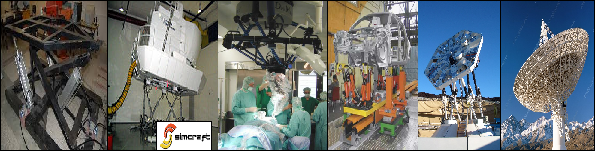

# Didaplat - An ESP32 based 3 Degrees of Freedom Parallel Robot Controller

Parallel robots, also known as Parallel Kinematic Mechanisms, are structures that have good performance in terms of precision, rigidity, and ability to handle heavy loads.

These characteristics make them ideal for jobs that require moving heavy loads with great precision, such as radars and telescopes; They are also used to move end effectors in machine tools, perform medically assisted surgery, joint rehabilitation in patients, flight simulators and movement simulators.

## This code is intended to use with a 3 Degrees of Freedom (DOF) Parallel Robot with an architecture like this:

    

## Electric Diagram conections:

    

## This project it is part of a research in Central University of Las Villas (UCLV), publications:
- [ResearchGate](https://www.researchgate.net/publication/338014888_DidaPlat_Plataforma_robotica_de_bajo_costo_con_3_GDL_para_fines_educativos)
- [DidaPlat: plataforma robótica de bajo costo con 3 GDL para fines educativos](https://dspace.uclv.edu.cu/handle/123456789/12572)
- [Serie Científica Universidad de las Ciencias Informáticas](https://publicaciones.uci.cu/index.php/serie/article/view/497)

